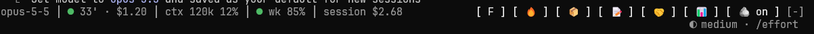

# claude-session-band

A **mod** (function-hook plugin) for Claude Code, named `session-band`. It puts a one-line band right above the prompt that
**tracks** your session (prompt cache, context, usage limits, cost) and **manages** it (keep warm, compact, handoff, model switch, save notes) in one click.



Why: notice before the prompt cache goes cold, avoid paying to re-write it, and compact or hand off in time when the context grows.

## Install

```bash
claude plugin marketplace add einaruk/claude-session-band
claude plugin install session-band@session-band
```

Then restart Claude Code. The band appears above the prompt after the first reply.

> Note: tested in the terminal on Windows PowerShell and WSL; not tested in the Claude Code desktop app.

### Install instructions for an agent

This section is for a Claude Code agent installing the mod on the user's behalf. Follow the steps in order:

1. Run `claude --version`. Function-hook mod support is required; tested with 2.1.291. If older, suggest `claude update` to the user and stop.
2. Run `claude plugin marketplace add einaruk/claude-session-band`.
3. Run `claude plugin install session-band@session-band`.
4. Confirm that `session-band` appears in the output of `claude plugin list`.
5. Tell the user to restart Claude Code; the band shows up after the first reply. In a new session, `/session-band` opens the details pane.
6. Do not edit `settings.json`; the marketplace install is enough. If a step fails, show its output to the user verbatim and do not try another route.

Optional dependency: the 🪨 button toggles the caveman plugin. Without it the button only writes a flag file and has no effect.

### Alternative: from a local folder

```bash
git clone https://github.com/einaruk/claude-session-band.git ~/.claude/mods/session-band
```

Set `env.CLAUDE_CODE_PLUGIN_DIRS` in `~/.claude/settings.json` to `~/.claude/mods/session-band`
(several folders: separate with `;` on Windows, `:` on macOS/Linux/WSL). For a one-session trial: `claude --plugin-dir ~/.claude/mods/session-band`.

## What is on the band

Figures on the left, buttons on the right. The colored dot in front of a figure shows its state: green fine, yellow watch, red act now.

**Table 1 (v1.0) — Band figures (left to right)**

| # | Figure | Example | Meaning |
|---|--------|---------|---------|
| 1 | Model | `opus-5-5` | The model running the session |
| 2 | Cache | `47' · $0.85` | Time until the prompt cache goes cold · estimated cost to re-warm it if it does. `cold · $0.85` = it went cold; the next prompt re-writes the whole context |
| 3 | Context | `ctx 159k/300k` | Tokens in context / auto-compact point (when off: `ctx 159k 16%` = share of the window) |
| 4 | Limits | `5h 72%` · `wk 40%` | What is left of the 5-hour and weekly usage limits (shown on a subscription) |
| 5 | Session cost | `session $3.20` | The session's cost at API rates |

**Table 2 (v1.0) — Band buttons**

| # | Icon | What it does |
|---|------|--------------|
| 1 | `O` / `F` | Switch model: on Fable, `O` → Opus 5.5; on Opus, `F` → Fable 5.1 (runs `/model`) |
| 2 | 🔥 | Keep warm: sends a short "ok" turn that resets the cache timer (hidden once the cache is cold) |
| 3 | 📦 | Compact now: runs `/compact` with the configured instructions |
| 4 | 📝 | Save notes: runs the skill set in `saveCommand`; when none is set, sends a prompt asking Claude to update the project's working notes |
| 5 | 🤝 | Handoff: has Claude write a handoff note for a fresh session; when it is ready the band shows **Clear & continue** → `/clear` + the note sent as the first message |
| 6 | 📊 | Details: opens the details pane (TTL, when limits reset, auto-compact −/+ buttons) |
| 7 | 🪨 on/off | Toggles the caveman plugin (terse replies). Without the plugin it only writes a flag file and has no effect |

Buttons hide while a turn runs and before the first reply (except the model switch and 📊).
A toast warns `warnMinutes` (default 5) before the cache goes cold.

The same actions are available as a command: `/session-band [open|warm|compact|handoff|save|continue|caveman|autocompact <250k|off|auto>]`

## Settings

`.claude-plugin/plugin.json` → `userConfig` (also editable from Claude Code's plugin settings):

**Table 3 (v1.0) — Settings**

| # | Setting | Default | Note |
|---|---------|---------|------|
| 1 | `cacheTtl` | `auto` | 1h on a subscription, 5m otherwise; corrected by what the API actually served after a gap |
| 2 | `warnMinutes` | `5` | How many minutes before the cache goes cold to warn |
| 3 | `inputPricePerMTok` | `0` | 0 = calibrate from the session's own cost ledger |
| 4 | `autoCompact` | `off` | `auto` = 300k on 1M-context models, 70% of smaller windows; or a fixed point such as `250k` |
| 5 | `handoffCommand` | `anthropic-skills:context-handoff` | Falls back to a built-in handoff prompt when missing |
| 6 | `saveCommand` | empty | Skill the 📝 button runs; empty sends a built-in prompt |
| 7 | `compactInstructions` | "what to keep / what to drop" summary instructions | Passed as the argument to 📦 and to auto-compact |

## Credits and license

Built on [etding/cache-keeper](https://github.com/etding/cache-keeper) (MIT, commit `6a2ba1b`) and adapted for personal use:
model chip and Fable ↔ Opus switch, session cost chip, borderless rendering in the terminal, 📝 save notes button,
🪨 caveman toggle, auto-compact off by default, custom compact instructions.
License: MIT; the original copyright line is kept in `LICENSE`.
